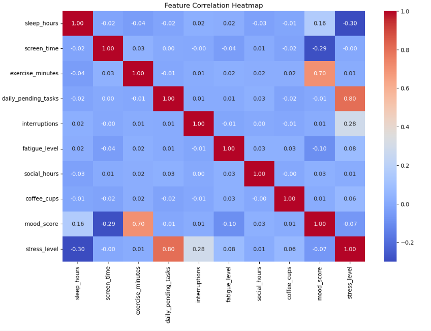
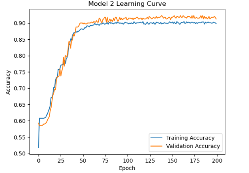
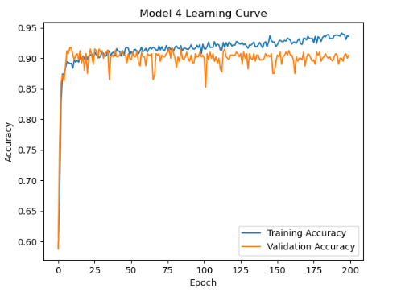
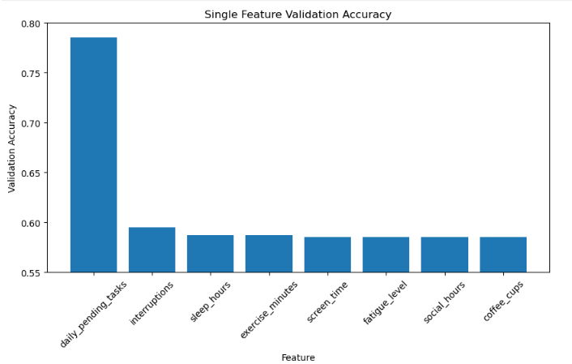
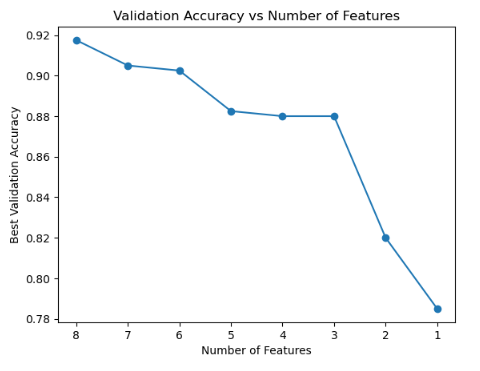
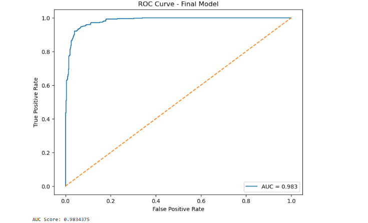

# Predicting Stress Levels from Lifestyle Habits Using Neural Networks

## Overview
This project explores whether daily lifestyle habits can be used to predict stress levels using feed-forward neural networks. The project compares neural networks against manually designed baseline predictors and evaluates performance using accuracy, ROC curves, and AUC scores.

## Technologies Used
- Python
- Pandas
- NumPy
- Matplotlib
- TensorFlow / Keras
- Scikit-learn

## Dataset
Synthetic lifestyle and mental health dataset containing 2,000 records with features such as:
- Sleep hours
- Exercise frequency
- Daily interruptions
- Coffee intake
- Social activity
- Pending tasks
- Fatigue level

## Exploratory Data Analysis

### Correlation Heatmap

## Model Development
The project compared:
- Additive scoring predictor
- Rule-based predictor
- Feed-forward neural networks with different architectures

## Learning Curves

### Model 2 Learning Curve

### Model 4 Learning Curve

## Feature Importance

### Single Feature Performance

### Feature Reduction Experiment

## ROC Curve and AUC

## Final Results
- Best validation accuracy: 92.25%
- AUC score: 0.983
- Best architecture: 1 hidden layer with 8 neurons

## Files
- `FinalProjNN.ipynb` → Complete notebook
- `Can Daily Lifestyle Factors Predict Stress Levels.pdf` → Final report
